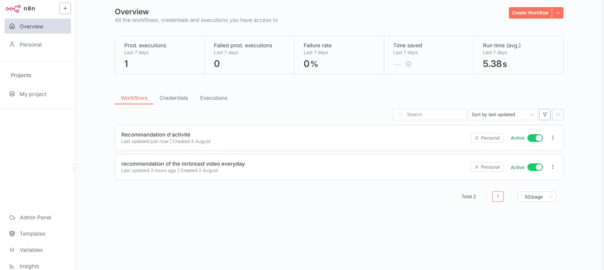
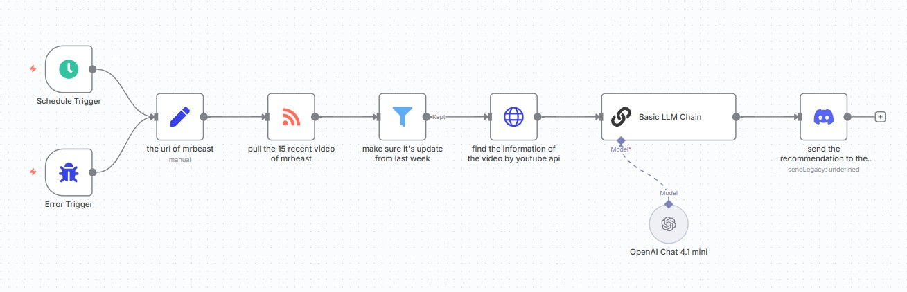
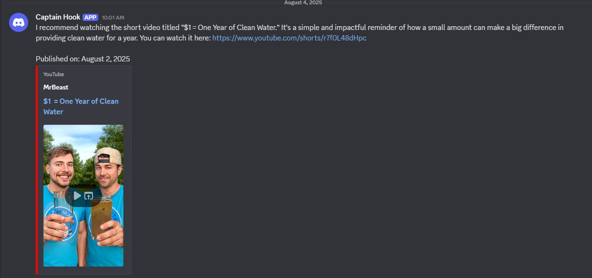
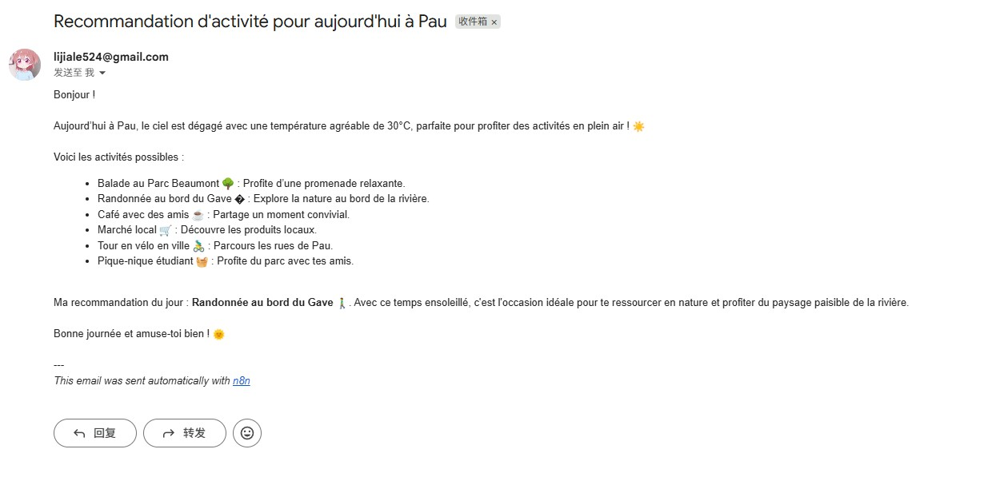
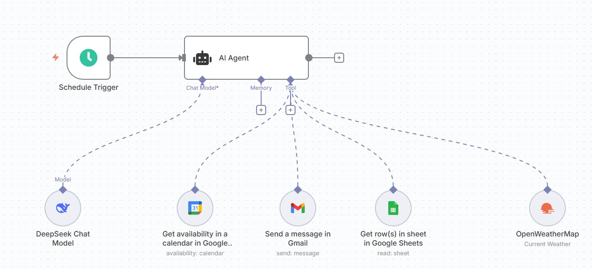
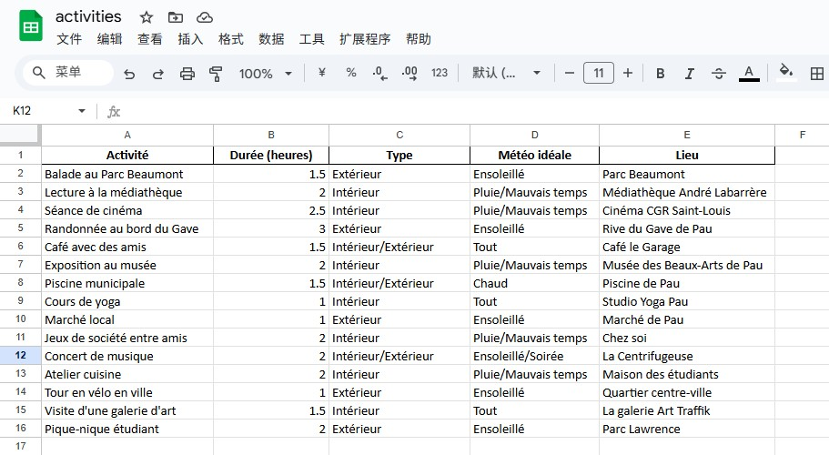

# n8n Workflow Collection

> 🚀 **Voici les workflows que j'ai conçus ces deux derniers jours, tous testés et opérationnels sur ma propre instance n8n !**  
> Grâce à ces automatisations, je peux désormais orchestrer mes tâches du quotidien et des projets personnels de façon totalement no-code.

---

## 🖼️ **Présentation visuelle — Screenshots**

   
  <em>Vue d'ensemble de mon workspace n8n avec les workflows actifs.</em>

---

## 🌟 Projets inclus / Included Projects

### 1. Recommandation automatique de vidéos MrBeast sur Discord  
**Automated MrBeast YouTube video recommendations sent to Discord**

- Récupération des dernières vidéos de MrBeast via RSS et Google API
- Génération d’une recommandation personnalisée à l’aide de GPT-4.1 mini
- Envoi automatique sur un serveur Discord chaque semaine

  

> **Exemple de message envoyé automatiquement sur Discord :**
>
> 

---

### 2. Assistant personnel Google Sheet → Email  
**Personal planner assistant: Google Sheet to daily email**

- Génération d’une recommandation personnalisée à l’aide de DeepSeek
- Lecture quotidienne des plannings depuis Google Sheet
- Sélection automatique des meilleures suggestions de sortie du jour
- Envoi par email chaque matin avec résumé personnalisé

  &nbsp;&nbsp;
   
  <em>Exemple de mail reçu et schéma du workflow n8n associé.</em>

> **📋 Base d'activités d'étudiant à Pau**  
> Toutes les activités sont maintenues dans un Google Sheet :  
> météo idéale, durée, type, lieu, etc.  
> Ce Sheet sert de base dynamique pour adapter chaque recommandation du matin à la météo et au planning.
>
> 

---

## 💡 Importer les workflows / How to import workflows

Tous les fichiers des workflows présentés ci-dessus sont disponibles dans le dossier json,
Vous pouvez les télécharger puis les importer dans n8n via “Importer un workflow”.

**fichiers disponibles :**

- Recommandation_Mrbeast.json
- Recommandation_Température.json

1. Télécharger le fichier `.json` correspondant.
2. Aller sur votre interface n8n → “Importer un workflow”
3. Uploader le fichier
4. Configurer vos clés API, webhook Discord, ou email selon besoin

---

**Auteur / Author:**  
Li Jiale  
ESIEE-IT, Alternance Big Data & IA, 2025

---

_Contactez-moi pour toute question, suggestion ou collaboration !_
